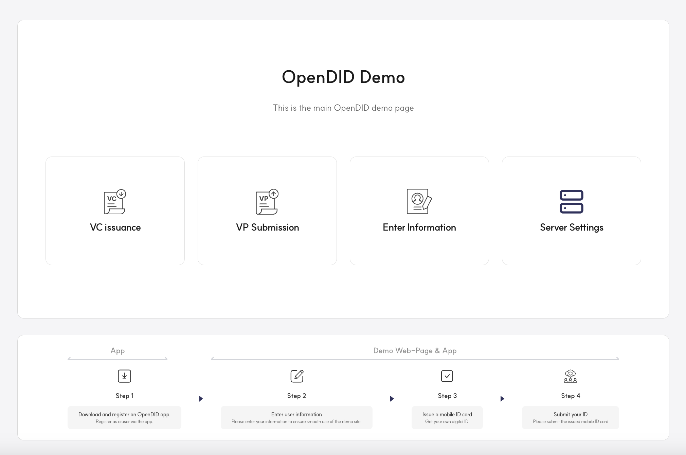
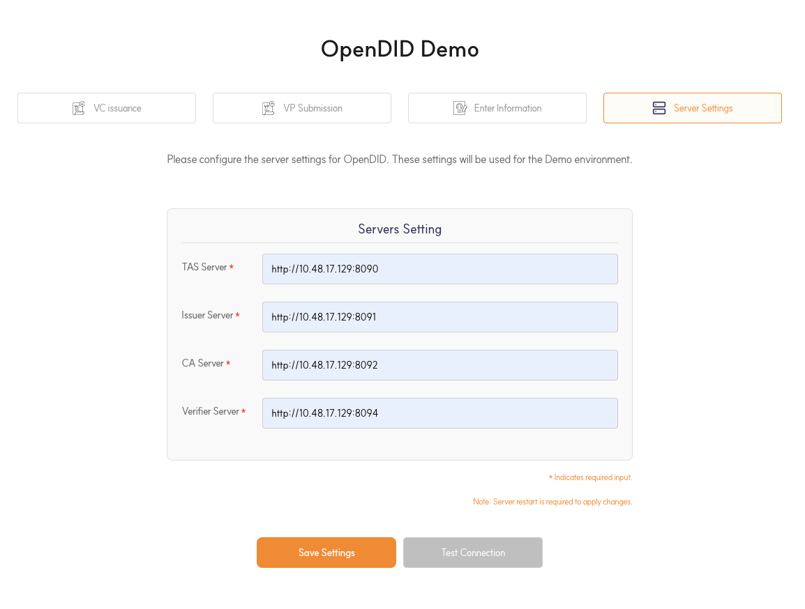
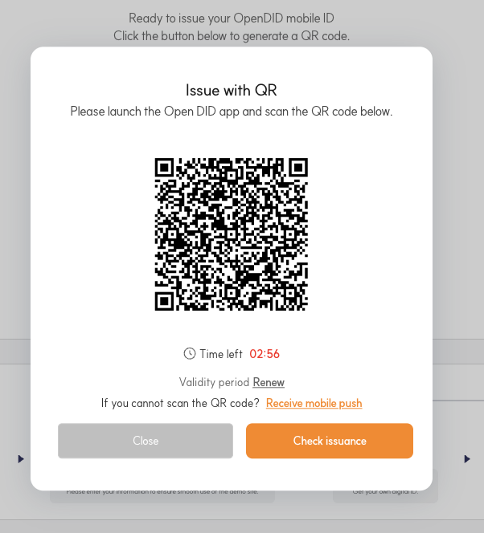

---
puppeteer:
    pdf:
        format: A4
        displayHeaderFooter: true
        landscape: false
        scale: 0.8
        margin:
            top: 1.2cm
            right: 1cm
            bottom: 1cm
            left: 1cm
    image:
        quality: 100
        fullPage: false
---

Open DID Demo Server Installation And Operation Guide
==

- Date: 2025-05-30
- Version: v2.0.0

Table of Contents
==

- [Table of Contents](#table-of-contents)
- [1. Introduction](#1-introduction)
  - [1.1. Overview](#11-overview)
  - [1.2. Demo Server Definition](#12-demo-server-definition)
  - [1.3. System Requirements](#13-system-requirements)
- [2. Prerequisites](#2-prerequisites)
  - [2.1. Git Installation](#21-git-installation)
- [3. Cloning Source Code from GitHub](#3-cloning-source-code-from-github)
  - [3.1. Source Code Cloning](#31-source-code-cloning)
  - [3.2. Directory Structure](#32-directory-structure)
- [4. Server Startup Methods](#4-server-startup-methods)
  - [4.1. Running with IntelliJ IDEA (Gradle Support)](#41-running-with-intellij-idea-gradle-support)
    - [4.1.1. IntelliJ IDEA Installation and Setup](#411-intellij-idea-installation-and-setup)
    - [4.1.2. Opening Project in IntelliJ](#412-opening-project-in-intellij)
    - [4.1.3. Gradle Build](#413-gradle-build)
    - [4.1.4. Server Startup](#414-server-startup)
    - [4.1.5. Server Configuration](#415-server-configuration)
  - [4.2. Running with Console Commands](#42-running-with-console-commands)
    - [4.2.1. Gradle Build Commands](#421-gradle-build-commands)
    - [4.2.2. Server Startup Method](#422-server-startup-method)
    - [4.2.3. Server Configuration Method](#423-server-configuration-method)
- [5. Configuration Guide](#5-configuration-guide)
  - [5.1. application.yml](#51-applicationyml)
    - [5.1.1. Spring Basic Configuration](#511-spring-basic-configuration)
    - [5.1.2. Jackson Basic Configuration](#512-jackson-basic-configuration)
    - [5.1.3. Server Configuration](#513-server-configuration)    
  - [5.2. application-logging.yml](#52-application-loggingyml)
    - [5.2.1. Logging Configuration](#521-logging-configuration)  
  - [5.3. application-spring-docs.yml](#53-application-spring-docsyml)
- [6. Demo Operation Guide](#6-demo-operation-guide)
  - [6.1. Screen Layout](#61-screen-layout)
  - [6.2. Operation Server Configuration](#62-operation-server-configuration)
  - [6.3. User Information Input](#63-user-information-input)
  - [6.4. VC Issuance](#64-vc-issuance)
  - [6.5. VP Submission](#65-vp-submission)
  - [6.6. Server Connection Test](#66-server-connection-test)
  - [6.7. Major Error Situations and Solutions](#67-major-error-situations-and-solutions)

# 1. Introduction

## 1.1. Overview
This document provides a guide for installing and operating the Demo server. It explains the installation process, configuration methods, and startup procedures step by step to help users efficiently install and operate the system.

For the overall installation guide of OpenDID, please refer to the [Open DID Installation Guide].

<br/>

## 1.2. Demo Server Definition

The Demo server is a demo project provided by Open DID.<br>
It provides a screen where you can test VC issuance, submission, user registration, and server setting functions.

<br/>

## 1.3. System Requirements
- **Java 21** or higher
- **Gradle 7.0** or higher
- **Docker** and **Docker Compose** (when using Docker)
- Minimum **2GB RAM** and **10GB disk space**

<br/>

# 2. Prerequisites

This chapter guides you through the prerequisite items needed before installing the components of the Open DID project.

## 2.1. Git Installation

`Git` is a distributed version control system that tracks changes in source code and supports collaboration among multiple developers. Git is essential for managing the source code of the Open DID project and version control.

If the installation is successful, you can check the Git version using the following command:

```bash
git --version
```

> **Reference Links**
> - [Git Installation Guide](https://docs.github.com/en/repositories/creating-and-managing-repositories/cloning-a-repository)

<br/>

# 3. Cloning Source Code from GitHub

## 3.1. Source Code Cloning

The `git clone` command is used to clone source code from a remote repository hosted on GitHub to your local computer. Using this command allows you to work with the entire source code and related files of the project locally. After cloning, you can perform necessary work within the repository and push changes back to the remote repository.

Open a terminal and execute the following commands to copy the DEMO server repository to your local computer:
```bash
# Clone repository from Git repository
git clone https://github.com/OmniOneID/did-demo-server.git

# Navigate to the cloned repository
cd did-demo-server
```

> **Reference Links**
> - [Git Clone Guide](https://docs.github.com/en/repositories/creating-and-managing-repositories/cloning-a-repository)

<br/>

## 3.2. Directory Structure
The main directory structure of the cloned project is as follows:

```
did-demo-server
├── CHANGELOG.md
├── CLA.md
├── CODE_OF_CONDUCT.md
├── CONTRIBUTING.md
├── LICENSE
├── dependencies-license.md 
├── MAINTAINERS.md
├── README.md
├── RELEASE-PROCESS.md
├── SECURITY.md
├── docs
│   └── installation
│       └── OpenDID_DemoServer_InstallationAndOperation_Guide.md
└── source
    └── demo
        ├── gradle
        ├── libs
            └── did-crypto-sdk-server-2.0.0.jar
        └── src
        └── build.gradle
        └── README.md
```

| Name                    | Description                                      |
| ----------------------- | ------------------------------------------------ |
| CHANGELOG.md            | Version-specific changes of the project         |
| CODE_OF_CONDUCT.md      | Code of conduct for contributors                 |
| CONTRIBUTING.md         | Contribution guidelines and procedures           |
| LICENSE                 | License information                              |
| dependencies-license.md | License information of project dependencies      |
| MAINTAINERS.md          | Guidelines for project maintainers              |
| RELEASE-PROCESS.md      | Procedures for releasing new versions            |
| SECURITY.md             | Security policy and vulnerability reporting      |
| docs                    | Documentation                                    |
| ┖ installation          | Installation and configuration guides           |
| source                  | Source code                                      |
| ┖ demo                  | Demo server source code and build files         |
| ┖ gradle                | Gradle build configuration and scripts          |
| ┖ libs                  | External libraries and dependencies              |
| ┖ sample                | Sample files                                     |
| ┖ src                   | Main source code directory                       |
| ┖ build.gradle          | Gradle build configuration file                  |
| ┖ README.md             | Source code overview and guidance                |

<br/>

# 4. Server Startup Methods
This chapter guides you through two methods of starting the server.

The project source is located under the `source` directory, and you need to load and configure the source from that directory according to each startup method.

1. **Using IDE**: You can open the project in an Integrated Development Environment (IDE), set up execution configuration, and run the server directly. This method is useful for quickly testing code changes during development.

2. **Using Build and Console Commands**: After building the project, you can start the server by executing the generated JAR file with console commands (`java -jar`). This method is mainly used when deploying the server or running it in production environments.
   
## 4.1. Running with IntelliJ IDEA (Gradle Support)

IntelliJ IDEA is an Integrated Development Environment (IDE) widely used for Java development, supporting build tools like Gradle for easy project setup and dependency management. Since Open DID servers are built using Gradle, you can easily set up projects and run servers in IntelliJ IDEA.

### 4.1.1. IntelliJ IDEA Installation and Setup
1. Install IntelliJ. (Refer to the link below for installation instructions)

> **Reference Links**
> - [IntelliJ IDEA Download](https://www.jetbrains.com/idea/download/)

### 4.1.2. Opening Project in IntelliJ
- Launch IntelliJ and select `File -> New -> Project from Existing Sources`. When the file selection window appears, select the 'source/did-demo-server' folder from the repository cloned in [3.1. Source Code Cloning](#31-source-code-cloning).
- When you open the project, the build.gradle file is automatically recognized.
- Gradle automatically downloads necessary dependency files, wait for this process to complete.

### 4.1.3. Gradle Build
- In IntelliJ IDEA's `Gradle` tab, execute `Tasks -> build -> build`.
- Once the build completes successfully, the project is ready to run.

### 4.1.4. Server Startup
- In IntelliJ IDEA's Gradle tab, select Tasks -> application -> bootRun and execute.
- Gradle automatically builds and runs the server.
- Check the console logs for the "Started [ApplicationName] in [time] seconds" message to confirm the server started successfully.
- Once the server is running properly, navigate to http://localhost:8099/swagger-ui/index.html in your browser to verify that the API documentation is displayed correctly through Swagger UI.

<br/>

### 4.1.5. Server Configuration
- The server needs to modify necessary configurations according to the deployment environment to ensure stable operation. For example, this includes the address of the TAS server to integrate with the Demo server.
- Server configuration files are located in the `src/main/resource/config` path.
- For detailed configuration methods, please refer to [5. Configuration Guide](#5-configuration-guide).

<br/>

## 4.2. Running with Console Commands

This section guides you through running the Open DID server using console commands. It explains the process of building the project using Gradle and starting the server using the generated JAR file.

### 4.2.1. Gradle Build Commands

- Build the source using gradlew:
  ```shell
    # Navigate to the source folder of the cloned repository
    cd source/demo

    # Grant execution permission to Gradle Wrapper
    chmod 755 ./gradlew

    # Clean build the project (delete previous build files and build new ones)
    ./gradlew clean build
  ```
  > Note
  > - gradlew is short for Gradle Wrapper, a script used to execute Gradle in projects. Even if Gradle is not installed locally, it automatically downloads and executes the version of Gradle specified by the project. This allows developers to build projects in the same environment regardless of whether Gradle is installed.

- Navigate to the built folder and verify that the JAR file has been created:
    ```shell
      cd build/libs
      ls
    ```
- This command creates the `did-demo-server-2.0.0.jar` file.

<br/>

### 4.2.2. Server Startup Method
Start the server using the built JAR file:

```bash
java -jar did-demo-server-2.0.0.jar
```

- Once the server is running properly, navigate to http://localhost:8099/swagger-ui/index.html in your browser to verify that the API documentation is displayed correctly through Swagger UI.

<br/>

### 4.2.3. Server Configuration Method
- The server needs to modify necessary configurations according to the deployment environment to ensure stable operation. For example, you need to adjust components like database connection information, port numbers, and email integration information for each environment.
- Server configuration files are located in the `src/main/resource/config` path.
- For detailed configuration methods, please refer to [5. Configuration Guide](#5-configuration-guide).

<br/>

# 5. Configuration Guide

This chapter guides you through all configuration values included in the server's configuration files. Each configuration is an important element that controls the server's operation and environment, and proper configuration is necessary for stable server operation. Please refer to the item-specific descriptions and examples to apply configurations suitable for each environment.

Please note that configurations with the 🔒 icon are basically fixed values or values that generally do not need to be modified.

## 5.1. application.yml

- Role: The application.yml file defines the basic settings for Spring Boot applications. Through this file, you can specify various environment variables such as application name, database settings, and profile settings, which significantly affect how the application operates.

- Location: `src/main/resources/`

### 5.1.1. Spring Basic Configuration
Spring's basic configuration defines the application name and profiles to activate, playing an important role in setting up the server's operating environment.

* `spring.application.name`: 🔒
    - Specifies the application name.
    - Purpose: Mainly used to identify applications in log messages, monitoring tools, or Spring Cloud services
    - Example: `demo`

* `spring.profiles.active`:  
  - Defines the profile to activate.
  - Purpose: Select either sample or development environment to load configurations suitable for that environment.
  - Supported profiles: dev
  - Example: `dev`

* `spring.profiles.group.dev`: 🔒
  - Defines individual profiles included in the `dev` profile group.
  - Purpose: Groups and manages configurations to be used in development environments.
  - Profile file naming convention: Configuration files corresponding to each profile use the exact names defined within the group. For example, the logging profile is written as application-logging.yml, and the spring_docs profile is written as application-spring-docs.yml. File names must use the exact names written under group.dev.

<br/>

### 5.1.2. Jackson Basic Configuration

Jackson is the JSON serialization/deserialization library used by default in Spring Boot. Through Jackson configuration, you can adjust JSON data serialization methods or formats, improving performance and efficiency during data transmission.

* `spring.jackson.default-property-inclusion`: 🔒 
    - Configured to not generate errors when serializing empty objects.
    - Example: false

<br/>

### 5.1.3. Server Configuration 
Server configuration defines the port number where the application will receive requests.

* `server.port`:  
    - The port number where the application will run. The default port for Demo server is 8099.
    - Value: 8099

<br/>

## 5.2. application-logging.yml
- Role: Sets log groups and log levels. Through this configuration file, you can define log groups for specific packages or modules and individually specify log levels for each group.

- Location: `src/main/resources/`
  
### 5.2.1. Logging Configuration

- Log Groups: Under logging.group, you can group and manage desired packages. For example, include the org.omnione.did.base.util package in the util group and define other packages as individual groups.

- Log Levels: Through logging.level settings, you can specify log levels for each group. You can set various log levels such as debug, info, warn, error to output logs at desired levels. For example, you can set debug level for groups like demo, aop to output debug information from those packages.

* `logging.level`: 
    - Sets log levels.
    - By setting the level to debug, you can see all log messages at DEBUG level and above (INFO, WARN, ERROR, FATAL) for specified packages.

Full example:
```yaml
logging:
  level:
    org.omnione: debug
```

<br/>

## 5.3. application-spring-docs.yml
- Role: Manages SpringDoc and Swagger UI settings in the application.

- Location: `src/main/resources/`

* `springdoc.swagger-ui.path`: 🔒
  - Defines the URL path to access Swagger UI.
  - Example: `/swagger-ui.html`

* `springdoc.swagger-ui.groups-order`: 🔒
  - Specifies the order to display API groups in Swagger UI.
  - Example: `ASC`

* `springdoc.swagger-ui.operations-sorter`: 🔒
  - Sorts API endpoints by HTTP method in Swagger UI.
  - Example: `method`

* `springdoc.swagger-ui.disable-swagger-default-url`: 🔒
  - Disables the default Swagger URL.
  - Example: `true`

* `springdoc.swagger-ui.display-request-duration`: 🔒
  - Sets whether to display request time in Swagger UI.
  - Example: `true`

* `springdoc.api-docs.path`: 🔒
  - Defines the path where API documentation is provided.
  - Example: `/api-docs`

* `springdoc.show-actuator`: 🔒
  - Sets whether to display Actuator endpoints in API documentation.
  - Example: `true`

* `springdoc.default-consumes-media-type`: 🔒
  - Sets the default media type for request body in API documentation.
  - Example: `application/json`

* `springdoc.default-produces-media-type`: 🔒
  - Sets the default media type for response body in API documentation.
  - Example: `application/json`

# 6. Demo Operation Guide

This chapter guides you through all configuration values included in the server's configuration files. Each configuration is an important element that controls the server's operation and environment, and proper configuration is necessary for stable server operation. Please refer to the item-specific descriptions and examples to apply configurations suitable for each environment.

This chapter provides basic guidance on operational procedures after completing all server configurations and startup. For detailed data structures and procedures, please refer to the [Open DID Software Architecture] document.

## 6.1. Screen Layout

The main screen is structured as shown above. The OpenDID Demo title is displayed at the top of the screen, and major functions such as VC issuance, VP submission, information input, and server settings are arranged in card format in the center.

## 6.2. Operation Server Configuration
The demo communicates with other servers for user information input, VC issuance, and VP submission. The main functions and roles of each server are as follows:

| Server Name | Main Function | Role Description |
|-------------|---------------|------------------|
| TAS Server | Transaction Authentication | User authentication and transaction management |
| Issuer Server | VC Issuance | Credential issuance and management |
| CA Server | Authentication Management | Certificate issuance and verification |
| Verifier Server | VP Verification | Verification of submitted Verifiable Presentations (VP) |

For server configuration, enter the IP address of the actually running server.



## 6.3. User Information Input
To use the OpenDID demo, you must input user information.
Since the demo issues VCs based on user information and submits VPs through them, this procedure is essential. User information includes the following items:

1. Basic User Information
   - First Name
   - Last Name
   - DID (User Identifier)
   - Email

2. Credential Type Selection (Example)
   - National ID
   - Mobile Driver's License (MDL)

Depending on the selected credential type, additional information must be entered.


## 6.4. VC Issuance 

The process for issuing a VC (Verifiable Credential) is as follows:

1. Select the credential to be issued.
   

   > Note: Credential issuance is only possible when registered in the credential issuance plan (VcPlan). 
   > For VC plan registration, please refer to the [Issuer Admin Guide] in detail.

2. Click the 'Search' button to select the issuance plan through a popup for selecting the VC to be issued.
   

3. Click the 'Issuance of ID card' button to request a QR code.
   - QR codes have a validity period and can be reset using the 'Renew' button.
   

4. VC issuance requests can be received through various methods:
   - QR Code Scan: Scan QR code with OpenDID app
   - Push Notification: Send push notification using registered user's DID in the app
   
   - Email: Send QR code to email entered in user information

## 6.5. VP Submission 
The process for submitting a VP (Verifiable Presentation) is as follows:

1. Select a VP policy.
   

   > Note: Pre-registered VP policies are required for VP submission. For registration methods, please refer to the [Verifier Admin Guide].

2. The VP submission procedure is similar to the VC issuance procedure:
   - Select VP policy
   - Click 'Submit your ID' button to issue QR code
   - Scan QR code with OpenDID app to submit VP
   - Confirm successful submission completion

## 6.6. Server Connection Test

After saving server settings, you can click the 'Test Connection' button to check connection status with each server. Connection testing verifies communication with the following servers:

- TAS Server
- Issuer Server
- CA Server
- Verifier Server

If connection testing succeeds, a message confirming normal connection with all servers is displayed. If it fails, it indicates which server connection failed and guides you to recheck server settings.

## 6.7. Major Error Situations and Solutions

| Error Situation | Cause | Solution |
|-----------------|-------|----------|
| QR Code Generation Failure | Server connection issue or VC plan not selected | Check server connection status and select VC plan |
| Push Notification Send Failure | Incorrect DID information or app not installed | Check DID information and app installation status |
| Email Send Failure | Incorrect email address | Check email address in user information |
| VC Issuance Failure | Missing required information or server error | Check all required information input and server logs |
| VP Submission Failure | No issued VC or VP policy issue | Check VC issuance status and review VP policy settings |
| Server Integration Failure | Server address setting error | Need to verify server address |

[Open DID Installation Guide]: https://github.com/OmniOneID/did-release/blob/develop/release-V2.0.0.0/OpenDID_Installation_Guide-V2.0.0.0_en.md

[Open DID Software Architecture]: https://omnioneid.github.io/?locale=en&version=V1.0.0
[Verifier Admin Guide]: https://github.com/OmniOneID/did-verifier-server/blob/develop/docs/admin/OpenDID_VerifierAdmin_Operation_Guide_en.md
[Issuer Admin Guide]: https://github.com/OmniOneID/did-issuer-server/blob/develop/docs/admin/OpenDID_IssuerAdmin_Operation_Guide_en.md