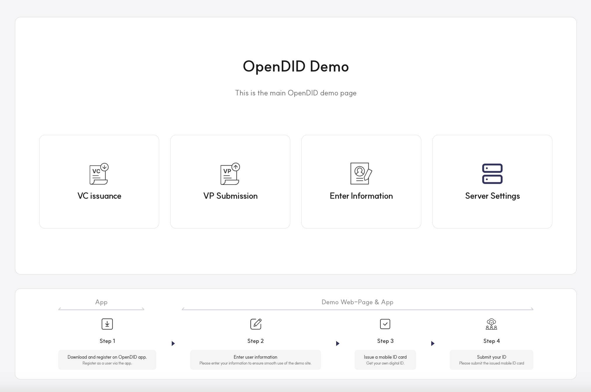
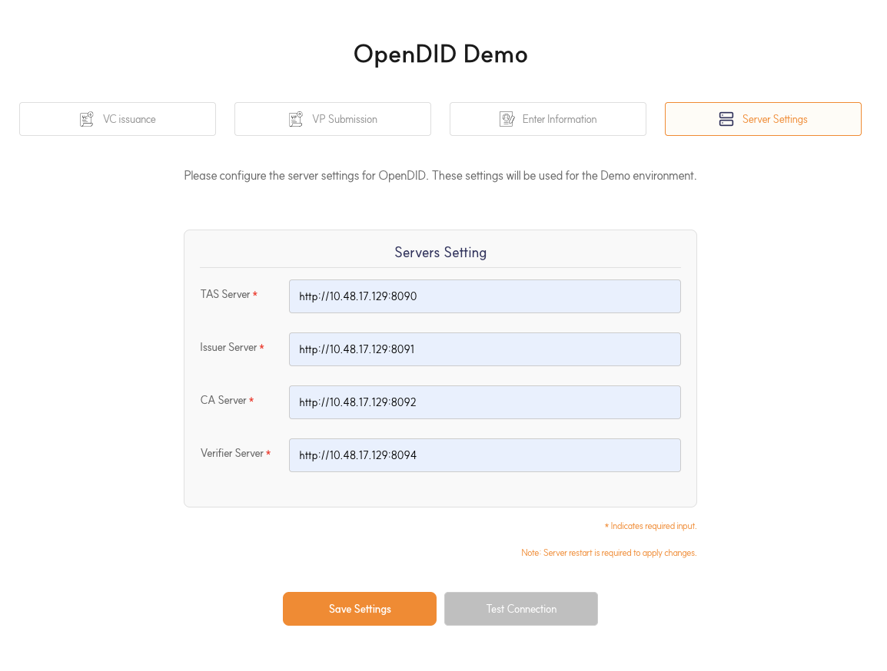
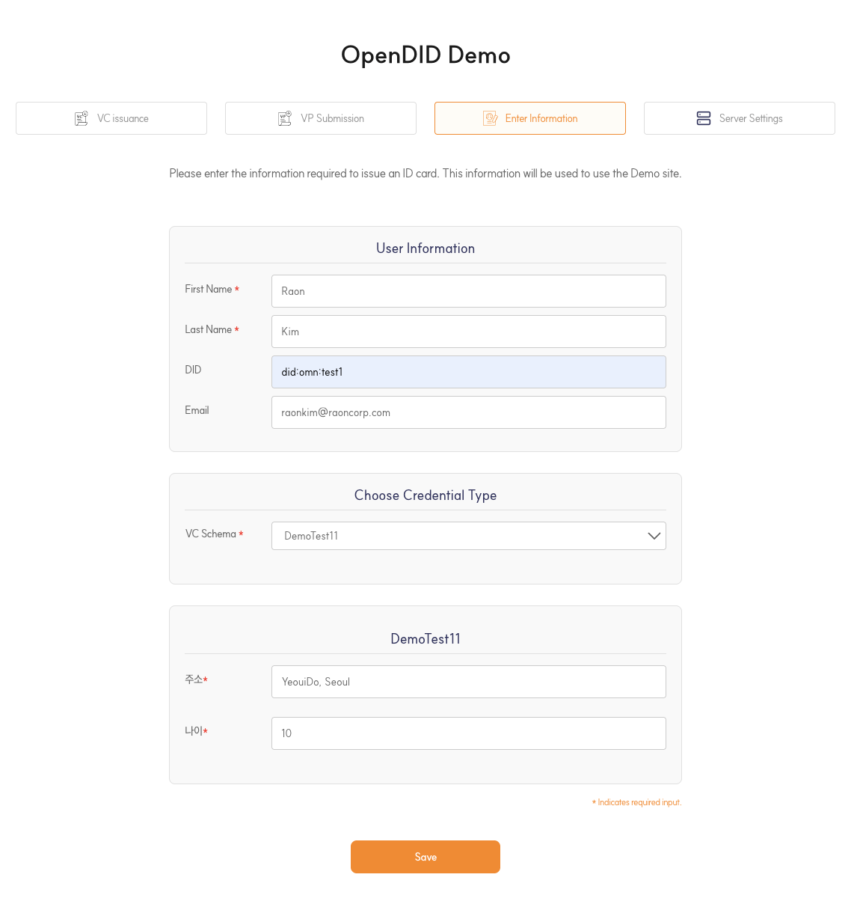
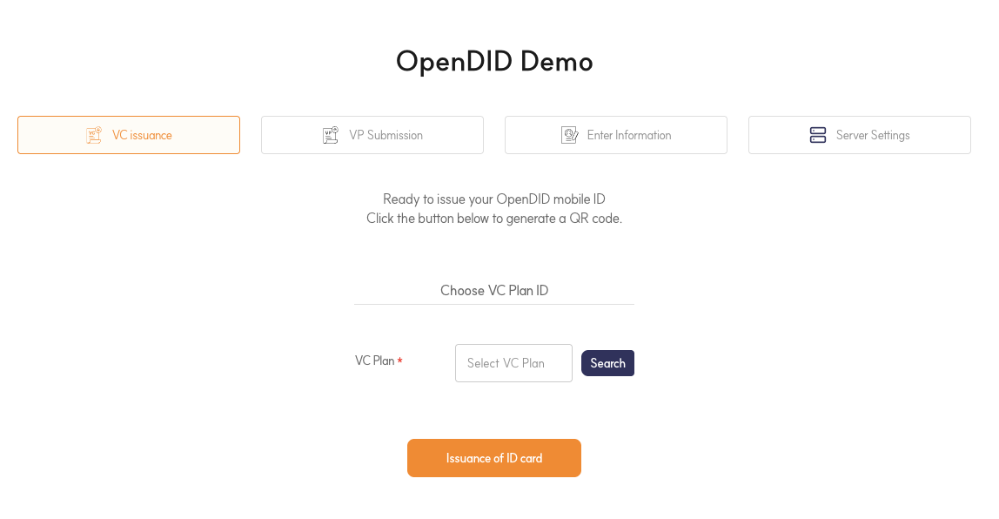
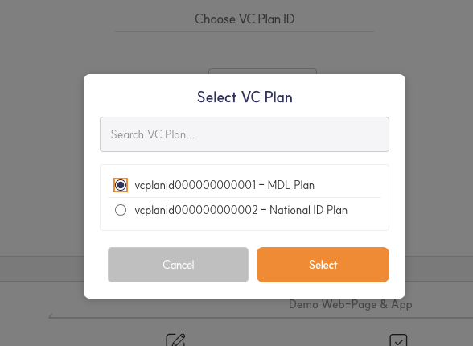
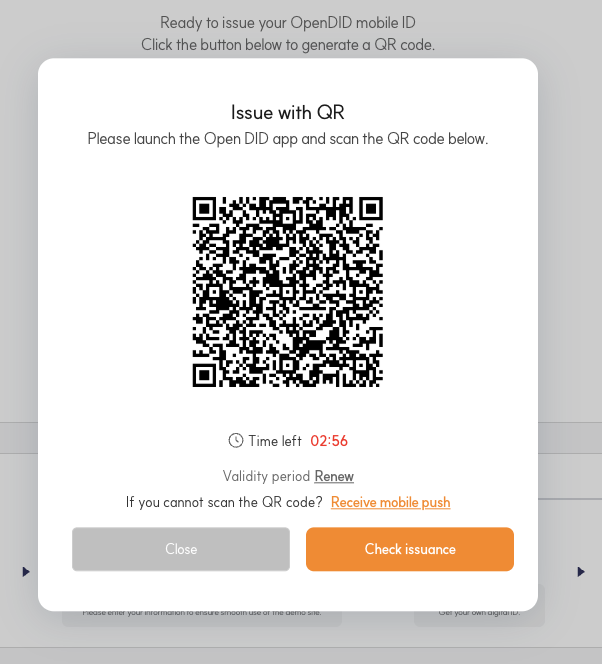
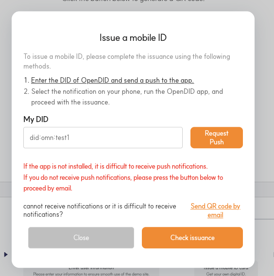
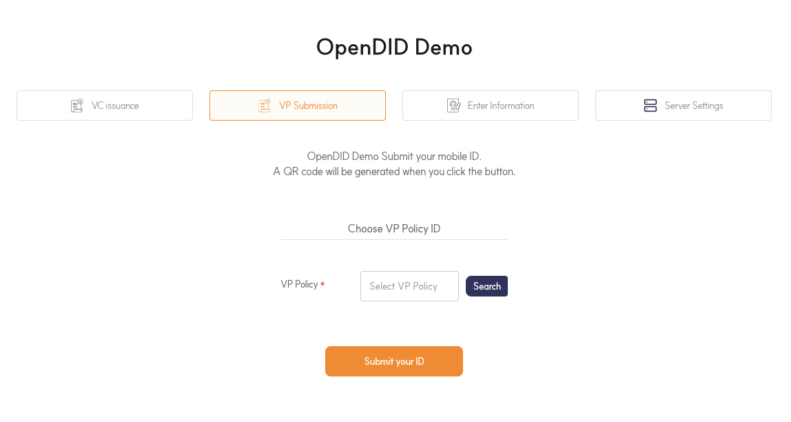

---
puppeteer:
    pdf:
        format: A4
        displayHeaderFooter: true
        landscape: false
        scale: 0.8
        margin:
            top: 1.2cm
            right: 1cm
            bottom: 1cm
            left: 1cm
    image:
        quality: 100
        fullPage: false
---

Open DID Demo Server Installation And Operation Guide
==

- Date: 2025-05-30
- Version: v2.0.0

목차
==

- [목차](#목차)
- [1. 소개](#1-소개)
  - [1.1. 개요](#11-개요)
  - [1.2. Demo 서버 정의](#12-demo-서버-정의)
  - [1.3. 시스템 요구 사항](#13-시스템-요구-사항)
- [2. 사전 준비 사항](#2-사전-준비-사항)
  - [2.1. Git 설치](#21-git-설치)
- [3. GitHub에서 소스 코드 복제하기](#3-github에서-소스-코드-복제하기)
  - [3.1. 소스코드 복제](#31-소스코드-복제)
  - [3.2. 디렉토리 구조](#32-디렉토리-구조)
- [4. 서버 구동 방법](#4-서버-구동-방법)
  - [4.1. IntelliJ IDEA로 구동하기 (Gradle 지원)](#41-intellij-idea로-구동하기-gradle-지원)
    - [4.1.1. IntelliJ IDEA 설치 및 설정](#411-intellij-idea-설치-및-설정)
    - [4.1.2. IntelliJ에서 프로젝트 열기](#412-intellij에서-프로젝트-열기)
    - [4.1.3. Gradle 빌드](#413-gradle-빌드)
    - [4.1.4. 서버 구동](#414-서버-구동)
    - [4.1.5. 서버 설정](#415-서버-설정)
  - [4.2. 콘솔 명령어로 구동하기](#42-콘솔-명령어로-구동하기)
    - [4.2.1. Gradle 빌드 명령어](#421-gradle-빌드-명령어)
    - [4.2.2. 서버 구동 방법](#422-서버-구동-방법)
    - [4.2.3. 서버 설정 방법](#423-서버-설정-방법)
- [5. 설정 가이드](#5-설정-가이드)
  - [5.1. application.yml](#51-applicationyml)
    - [5.1.1. Spring 기본 설정](#511-spring-기본-설정)
    - [5.1.2. Jackson 기본 설정](#512-jackson-기본-설정)
    - [5.1.3. 서버 설정](#513-서버-설정)    
  - [5.2. application-logging.yml](#52-application-loggingyml)
    - [5.2.1. 로깅 설정](#521-로깅-설정)  
  - [5.3. application-spring-docs.yml](#53-application-spring-docsyml)
- [6. 데모 운영 가이드](#6-데모-운영-가이드)
  - [6.1. 화면 구성](#61-화면-구성)
  - [6.2. 운영 서버 설정](#62-운영-서버-설정)
  - [6.3. 사용자 정보 입력](#63-사용자-정보-입력)
  - [6.4. VC 발급](#64-vc-발급)
  - [6.5. VP 제출](#65-vp-제출)
  - [6.6. 서버 연결 테스트](#66-서버-연결-테스트)
  - [6.7. 주요 에러 상황 및 해결 방법](#67-주요-에러-상황-및-해결-방법)

    

# 1. 소개

## 1.1. 개요
본 문서는 Demo 서버의 설치 및 구동에 관한 가이드를 제공합니다. Demo 서버의 설치 과정, 설정 방법, 그리고 구동 절차를 단계별로 설명하여, 사용자가 이를 효율적으로 설치하고 운영할 수 있도록 안내합니다.

OpenDID의 전체 설치에 대한 가이드는 [Open DID Installation Guide]를 참고해 주세요.

<br/>

## 1.2. Demo 서버 정의

Demo 서버는 Open DID에서 제공하는 데모 프로젝트입니다.<br>
VC 발급, 제출, 사용자 등록, 서버세팅 기능을 테스트할 수 있는 화면을 제공합니다.

<br/>

## 1.3. 시스템 요구 사항
- **Java 21** 이상
- **Gradle 7.0** 이상
- **Docker** 및 **Docker Compose** (Docker 사용 시)
- 최소 **2GB RAM** 및 **10GB 디스크 공간**

<br/>

# 2. 사전 준비 사항

이 장에서는 Open DID 프로젝트의 구성요소를 설치하기 전, 사전에 필요한 준비 항목들을 안내합니다.

## 2.1. Git 설치

`Git`은 분산 버전 관리 시스템으로, 소스 코드의 변경 사항을 추적하고 여러 개발자 간의 협업을 지원합니다. Git은 Open DID 프로젝트의 소스 코드를 관리하고 버전 관리를 위해 필수적입니다. 

설치가 성공하면 다음 명령어를 사용하여 Git의 버전을 확인할 수 있습니다.

```bash
git --version
```

> **참고 링크**
> - [Git 설치 가이드](https://docs.github.com/en/repositories/creating-and-managing-repositories/cloning-a-repository)

<br/>


# 3. GitHub에서 소스 코드 복제하기

## 3.1. 소스코드 복제

`git clone` 명령은 GitHub에 호스팅된 원격 저장소에서 로컬 컴퓨터로 소스 코드를 복제하는 명령어입니다. 이 명령을 사용하면 프로젝트의 전체 소스 코드와 관련 파일들을 로컬에서 작업할 수 있게 됩니다. 복제한 후에는 저장소 내에서 필요한 작업을 진행할 수 있으며, 변경 사항은 다시 원격 저장소에 푸시할 수 있습니다.

터미널을 열고 다음 명령어를 실행하여 DEMO 서버의 리포지토리를 로컬 컴퓨터에 복사합니다.
```bash
# Git 저장소에서 리포지토리 복제
git clone https://github.com/OmniOneID/did-demo-server.git

# 복제한 리포지토리로 이동
cd did-demo-server
```

> **참고 링크**
> - [Git Clone 가이드](https://docs.github.com/en/repositories/creating-and-managing-repositories/cloning-a-repository)

<br/>

## 3.2. 디렉토리 구조
복제된 프로젝트의 주요 디렉토리 구조는 다음과 같습니다:

```
did-demo-server
├── CHANGELOG.md
├── CLA.md
├── CODE_OF_CONDUCT.md
├── CONTRIBUTING.md
├── LICENSE
├── dependencies-license.md 
├── MAINTAINERS.md
├── README.md
├── RELEASE-PROCESS.md
├── SECURITY.md
├── docs
│   └── installation
│       └── OpenDID_DemoServer_InstallationAndOperation_Guide.md
└── source
    └── demo
        ├── gradle
        ├── libs
            └── did-crypto-sdk-server-2.0.0.jar
        └── src
        └── build.gradle
        └── README.md
```

| Name                    | Description                              |
| ----------------------- | ---------------------------------------- |
| CHANGELOG.md            | 프로젝트의 버전별 변경 사항              |
| CODE_OF_CONDUCT.md      | 기여자들을 위한 행동 강령                |
| CONTRIBUTING.md         | 기여 지침 및 절차                        |
| LICENSE                 | 라이선스 |
| dependencies-license.md  | 프로젝트 의존 라이브러리의 라이선스 정보 |
| MAINTAINERS.md          | 프로젝트 관리자를 위한 지침              |
| RELEASE-PROCESS.md      | 새로운 버전을 릴리스하는 절차            |
| SECURITY.md             | 보안 정책 및 취약성 보고 방법            |
| docs                    | 문서                                     |
| ┖ installation          | 설치 및 설정 가이드                      |
| source                  | 소스 코드                                |
| ┖ demo                  | Demo 서버 소스 코드 및 빌드 파일         |
| ┖ gradle                | Gradle 빌드 설정 및 스크립트             |
| ┖ libs                  | 외부 라이브러리 및 의존성                |
| ┖ sample                | 샘플 파일                                |
| ┖ src                   | 주요 소스 코드 디렉토리                  |
| ┖ build.gradle          | Gradle 빌드 설정 파일                    |
| ┖ README.md             | 소스 코드 개요 및 안내                   |

<br/>


# 4. 서버 구동 방법
이 장에서는 서버를 구동하는 두 가지 방법을 안내합니다.

프로젝트 소스는 `source` 디렉토리 하위에 위치하며, 각 구동 방법에 따라 해당 디렉토리에서 소스를 불러와 설정해야 합니다.

1. **IDE를 사용하는 방법**: 통합 개발 환경(IDE)에서 프로젝트를 열고, 실행 구성을 설정한 후 서버를 직접 실행할 수 있습니다. 이 방법은 개발 중에 코드 변경 사항을 빠르게 테스트할 때 유용합니다.

2. **Build 후 콘솔 명령어를 사용하는 방법**: 프로젝트를 빌드한 후, 생성된 JAR 파일을 콘솔에서 명령어(`java -jar`)로 실행하여 서버를 구동할 수 있습니다. 이 방법은 서버를 배포하거나 운영 환경에서 실행할 때 주로 사용됩니다.
   
## 4.1. IntelliJ IDEA로 구동하기 (Gradle 지원)

IntelliJ IDEA는 Java 개발에 널리 사용되는 통합 개발 환경(IDE)으로, Gradle과 같은 빌드 도구를 지원하여 프로젝트 설정 및 의존성 관리가 매우 용이합니다. Open DID의 서버는 Gradle을 사용하여 빌드되므로, IntelliJ IDEA에서 쉽게 프로젝트를 설정하고 서버를 실행할 수 있습니다.

### 4.1.1. IntelliJ IDEA 설치 및 설정
1. IntelliJ를 설치합니다. (설치 방법은 아래 링크를 참조)

> **참고 링크**
> - [IntelliJ IDEA 다운로드](https://www.jetbrains.com/idea/download/)

### 4.1.2. IntelliJ에서 프로젝트 열기
- IntelliJ를 실행시키고 `File -> New -> Project from Existing Sources`를 선택합니다. 파일 선택 창이 나타나면 [3.1. 소스코드 복제](#31-소스코드-복제) 에서 복제한 리포지토리에서 'source/did-demo-server' 폴더를 선택합니다.
- 프로젝트를 열면 build.gradle 파일이 자동으로 인식됩니다.
- Gradle이 자동으로 필요한 의존성 파일들을 다운로드하며, 이 과정이 완료될 때까지 기다립니다.

### 4.1.3. Gradle 빌드
- IntelliJ IDEA의 `Gradle` 탭에서 `Tasks -> build -> build`를 실행합니다. 
- 빌드가 성공적으로 완료되면, 프로젝트가 실행 가능한 상태로 준비됩니다.

### 4.1.4. 서버 구동
- IntelliJ IDEA의 Gradle 탭에서 Tasks -> application -> bootRun을 선택하고 실행합니다.
- Gradle이 자동으로 서버를 빌드하고 실행합니다.
- 콘솔 로그에서 "Started [ApplicationName] in [time] seconds" 메시지를 확인하여 서버가 정상적으로 실행되었는지 확인합니다.
- 서버가 정상적으로 구동되면, 브라우저에서 http://localhost:8099/swagger-ui/index.html 주소로 이동하여 Swagger UI를 통해 API 문서가 제대로 표시되는지 확인합니다.

<br/>

### 4.1.5. 서버 설정
- 서버는 배포 환경에 맞게 필요한 설정을 수정해야 하며, 이를 통해 서버가 안정적으로 작동할 수 있도록 해야 합니다. 예를 들어, Demo 서버와 연동할 TAS 서버의 주소 등이 있습니다.
- 서버의 설정 파일은 `src/main/resource/config` 경로에 위치해 있습니다.
- 자세한 설정 방법은 [5. 설정 가이드](#5-설정-가이드) 를 참고해 주세요.

<br/>

## 4.2. 콘솔 명령어로 구동하기

콘솔 명령어를 사용하여 Open DID 서버를 구동하는 방법을 안내합니다. Gradle을 이용해 프로젝트를 빌드하고, 생성된 JAR 파일을 사용하여 서버를 구동하는 과정을 설명합니다.

### 4.2.1. Gradle 빌드 명령어

- gradlew를 사용하여 소스를 빌드합니다.
  ```shell
    # 복제한 리포지토리로의 소스폴더로 이동
    cd source/demo

    # Gradle Wrapper 실행 권한을 부여
    chmod 755 ./gradlew

    # 프로젝트를 클린 빌드 (이전 빌드 파일을 삭제하고 새로 빌드)
    ./gradlew clean build
  ```
  > 참고
  > - gradlew은 Gradle Wrapper의 줄임말로, 프로젝트에서 Gradle을 실행하는 데 사용되는 스크립트입니다. 로컬에 Gradle이 설치되어 있지 않더라도, 프로젝트에서 지정한 버전의 Gradle을 자동으로 다운로드하고 실행할 수 있도록 해줍니다. 따라서 개발자는 Gradle 설치 여부와 상관없이 동일한 환경에서 프로젝트를 빌드할 수 있게 됩니다.

- 빌드된 폴더로 이동하여 JAR 파일이 생성된 것을 확인합니다.
    ```shell
      cd build/libs
      ls
    ```
- 이 명령어는 `did-demo-server-2.0.0.jar` 파일을 생성합니다.

<br/>

### 4.2.2. 서버 구동 방법
빌드된 JAR 파일을 사용하여 서버를 구동합니다:

```bash
java -jar did-demo-server-2.0.0.jar
```

- 서버가 정상적으로 구동되면, 브라우저에서 http://localhost:8099/swagger-ui/index.html 주소로 이동하여 Swagger UI를 통해 API 문서가 제대로 표시되는지 확인합니다.

<br/>

### 4.2.3. 서버 설정 방법
- 서버는 배포 환경에 맞게 필요한 설정을 수정해야 하며, 이를 통해 서버가 안정적으로 작동할 수 있도록 해야 합니다. 예를 들어, 데이터베이스 연결 정보, 포트 번호, 이메일 연동 정보 등 각 환경에 맞는 구성 요소들을 조정해야 합니다.
- 서버의 설정 파일은 `src/main/resource/config` 경로에 위치해 있습니다.
- 자세한 설정 방법은 [5. 설정 가이드](#5-설정-가이드) 를 참고하십시오.

<br/>


# 5. 설정 가이드

이 장에서는 서버의 모든 설정 파일에 포함된 각 설정 값에 대해 안내합니다. 각 설정은 서버의 동작과 환경을 제어하는 중요한 요소로, 서버를 안정적으로 운영하기 위해 적절한 설정이 필요합니다. 항목별 설명과 예시를 참고하여 각 환경에 맞는 설정을 적용하세요.

🔒 아이콘이 있는 설정은 기본적으로 고정된 값이거나, 일반적으로 수정할 필요가 없는 값임을 참고해주세요.

## 5.1. application.yml

- 역할: application.yml 파일은 Spring Boot 애플리케이션의 기본 설정을 정의하는 파일입니다. 이 파일을 통해 애플리케이션의 이름, 데이터베이스 설정, 프로파일 설정 등 다양한 환경 변수를 지정할 수 있으며, 애플리케이션의 동작 방식에 중요한 영향을 미칩니다.

- 위치: `src/main/resources/`

### 5.1.1. Spring 기본 설정
Spring의 기본 설정은 애플리케이션의 이름과 활성화할 프로파일 등을 정의하며, 서버의 동작 환경을 설정하는 데 중요한 역할을 합니다.

* `spring.application.name`: 🔒
    - 애플리케이션의 이름을 지정합니다.
    - 용도: 주로 로그 메시지, 모니터링 도구, 또는 Spring Cloud 서비스에서 애플리케이션을 식별하는 데 활용됩니다
    - 예시: `demo`

* `spring.profiles.active`:  
  - 활성화할 프로파일을 정의합니다. 
  - 용도: 샘플 또는 개발 환경 중 하나를 선택하여 해당 환경에 맞는 설정을 로드합니다. 
  - 지원 프로파일: dev
  - 예시: `dev`

* `spring.profiles.group.dev`: 🔒
  - `dev` 프로파일 그룹에 포함된 개별 프로파일을 정의합니다.
  - 용도: 개발 환경에서 사용할 설정들을 묶어 관리합니다.
  - 프로파일 파일명 규칙: 각 프로파일에 해당하는 설정 파일은 그룹 내에 정의된 이름 그대로 사용됩니다. 예를 들어, logging 프로파일은 application-logging.yml, spring_docs 프로파일은 application-spring-docs.yml로 작성됩니다. group.dev 아래에 적힌 이름 그대로 파일명을 사용해야 합니다.

<br/>

### 5.1.2. Jackson 기본 설정

Jackson은 Spring Boot에서 기본적으로 사용되는 JSON 직렬화/역직렬화 라이브러리입니다. Jackson의 설정을 통해 JSON 데이터의 직렬화 방식이나 포맷을 조정할 수 있으며, 데이터 전송 시 성능과 효율성을 높일 수 있습니다.

* `spring.jackson.default-property-inclusion`: 🔒 
    - 빈 객체를 직렬화할 때 오류를 발생시키지 않도록 설정합니다.
    - 예시: false

<br/>

### 5.1.3. 서버 설정 
서버 설정은 애플리케이션이 요청을 수신할 포트 번호 등을 정의합니다.

* `server.port`:  
    - 애플리케이션이 실행될 포트 번호입니다. Demo 서버의 기본 포트는 8099 입니다.
    - 값 : 8099

<br/>

## 5.2. application-logging.yml
- 역할: 로그 그룹과 로그 레벨을 설정합니다. 이 설정 파일을 통해 특정 패키지나 모듈에 대해 로그 그룹을 정의하고, 각 그룹에 대한 로그 레벨을 개별적으로 지정할 수 있습니다.

- 위치: `src/main/resources/`
  
### 5.2.1. 로깅 설정

- 로그 그룹: logging.group 아래에 원하는 패키지를 그룹화하여 관리할 수 있습니다. 예를 들어, util 그룹에 org.omnione.did.base.util 패키지를 포함하고, 다른 패키지도 각각의 그룹으로 정의합니다.

- 로그 레벨: logging.level 설정을 통해 각 그룹에 대해 로그 레벨을 지정할 수 있습니다. debug, info, warn, error 등 다양한 로그 레벨을 설정하여 원하는 수준의 로그를 출력할 수 있습니다. 예를 들어, demo, aop 등의 그룹에 debug 레벨을 설정하여 해당 패키지에서 디버그 정보를 출력하도록 할 수 있습니다.

* `logging.level`: 
    - 로그 레벨을 설정합니다.
    - 레벨을 debug 설정함으로써, 지정된 패키지에 대해 DEBUG 레벨 이상(INFO, WARN, ERROR, FATAL)의 모든 로그 메시지를 볼 수 있습니다.

전체 예시:
```yaml
logging:
  level:
    org.omnione: debug
```

<br/>

## 5.3. application-spring-docs.yml
- 역할: 애플리케이션에서 SpringDoc 및 Swagger UI 설정을 관리합니다.

- 위치: `src/main/resources/`

* `springdoc.swagger-ui.path`: 🔒
  - Swagger UI에 접근할 수 있는 URL 경로를 정의합니다.
  - 예시: `/swagger-ui.html`

* `springdoc.swagger-ui.groups-order`: 🔒
  - Swagger UI에서 API 그룹을 표시하는 순서를 지정합니다.
  - 예시: `ASC`

* `springdoc.swagger-ui.operations-sorter`: 🔒
  - Swagger UI에서 HTTP 메서드 기준으로 API 엔드포인트를 정렬합니다.
  - 예시: `method`

* `springdoc.swagger-ui.disable-swagger-default-url`: 🔒
  - 기본 Swagger URL을 비활성화합니다.
  - 예시: `true`

* `springdoc.swagger-ui.display-request-duration`: 🔒
  - Swagger UI에 요청 시간을 표시할지 여부를 설정합니다.
  - 예시: `true`

* `springdoc.api-docs.path`: 🔒
  - API 문서가 제공되는 경로를 정의합니다.
  - 예시: `/api-docs`

* `springdoc.show-actuator`: 🔒
  - API 문서에서 Actuator 엔드포인트를 표시할지 여부를 설정합니다.
  - 예시: `true`

* `springdoc.default-consumes-media-type`: 🔒
  - API 문서에서 요청 본문의 기본 미디어 타입을 설정합니다.
  - 예시: `application/json`

* `springdoc.default-produces-media-type`: 🔒
  - API 문서에서 응답 본문의 기본 미디어 타입을 설정합니다.
  - 예시: `application/json`

# 6. 데모 운영 가이드

이 장에서는 서버의 모든 설정 파일에 포함된 각 설정 값에 대해 안내합니다. 각 설정은 서버의 동작과 환경을 제어하는 중요한 요소로, 서버를 안정적으로 운영하기 위해 적절한 설정이 필요합니다. 항목별 설명과 예시를 참고하여 각 환경에 맞는 설정을 적용하세요.

이 장에서는 서버의 모든 설정을 완료, 기동을 한 뒤 사용하는 동작 절차에 대한 기본적인 안내입니다. 상세 데이터의 구조와 절차는 [Open DID Software Architecture] 문서를 참고해주세요.

## 6.1. 화면 구성

메인화면은 위와 같이 구성되어 있습니다. 화면 상단에는 OpenDID Demo 타이틀이 표시되고 중앙에는 VC 발급, VP 제출, 정보 입력, 서버 설정과 같은 주요 기능이 카드 형태로 배치되어 있습니다.

## 6.2. 운영 서버 설정
데모는 사용자 정보입력, VC의 발급, VP 제출을 위해 다른 서버들과 통신합니다. 서버별 주요 기능과 역할은 다음과 같습니다:

| 서버명 | 주요 기능 | 역할 설명 |
|--------|-----------|----------|
| TAS 서버 | 트랜잭션 인증 | 사용자 인증 및 트랜잭션 관리 |
| Issuer 서버 | VC 발급 | 자격증명 발급 및 관리 |
| CA 서버 | 인증 관리 | 인증서 발급 및 검증 |
| Verifier 서버 | VP 검증 | 제출된 검증가능한 제시(VP) 검증 |

서버 설정은 실제 기동한 서버의 IP 주소를 입력하면 됩니다. 



## 6.3. 사용자 정보 입력
OpenDID 데모를 사용하기 위해서는 사용자 정보를 입력해야 합니다.
데모는 사용자의 정보를 기반으로 VC를 발급받고 이를 통해 VP를 제출하므로, 이 절차는 필수적입니다. 사용자 정보는 다음과 같은 항목을 포함합니다:

1. 기본 사용자 정보
   - 이름 (First Name)
   - 성 (Last Name)
   - DID (사용자 식별자)
   - 이메일

2. 자격증명 유형 선택(예제)
   - 신분증 (National ID)
   - 모바일 운전면허증 (MDL)

선택한 자격증명 유형에 따라 추가 정보를 입력해야 합니다.



## 6.4. VC 발급 

VC(Verifiable Credential, 검증가능한 자격증명)를 발급받기 위한 과정은 다음과 같습니다:

1. 발급받을 자격증을 선택합니다.
   

   > 참고: 자격증 발급플랜(VcPlan)에 등록되어 있는 경우에만 자격증 발급이 가능합니다. 
   > VC 플랜 등록은 이슈어 가이드[Issuer Admin Guide]를 상세히 참고바랍니다.

2. 'Search' 버튼을 클릭하여 발급받을 VC를 선택하는 팝업을 통해 발급 계획을 선택합니다.
   

3. 'Issuance of ID card' 버튼을 클릭하여 QR 코드를 요청합니다. 
   - QR 코드는 유효시간이 있으며, 'Renew' 버튼을 통해 초기화할 수 있습니다.
   

4. VC 발급 요청은 다음과 같은 다양한 방법으로 받을 수 있습니다:
   - QR 코드 스캔: OpenDID 앱으로 QR 코드를 스캔
   - 푸시 알림: 앱에 등록된 사용자의 DID를 사용하여 푸시 알림 발송
   
   - 이메일: 사용자 정보에 입력된 이메일로 QR 코드 전송

## 6.5. VP 제출 
VP(Verifiable Presentation, 검증가능한 제시)를 제출하는 과정은 다음과 같습니다:

1. VP 정책을 선택합니다.
   

   > 참고: VP 제출을 위해서는 사전에 등록된 VP 정책이 필요합니다. 등록 방법은 Verifier 어드민 가이드[Verifier Admin Guide]를 참고해주세요.

2. VP 제출 절차는 VC 발급 절차와 유사합니다:
   - VP 정책 선택
   - 'Submit your ID' 버튼 클릭하여 QR 코드 발급
   - OpenDID 앱으로 QR 코드 스캔하여 VP 제출
   - 정상 제출 완료 여부 확인

## 6.6. 서버 연결 테스트

서버 설정을 저장한 후, 'Test Connection' 버튼을 클릭하여 각 서버와의 연결 상태를 확인할 수 있습니다. 연결 테스트는 다음과 같은 서버들과의 통신을 확인합니다:

- TAS 서버
- Issuer 서버
- CA 서버
- Verifier 서버

연결 테스트가 성공하면 모든 서버와의 연결이 정상임을 확인하는 메시지가 표시됩니다. 실패한 경우, 어떤 서버와의 연결이 실패했는지 알려주며 서버 설정을 다시 확인하도록 안내합니다.

## 6.7. 주요 에러 상황 및 해결 방법

| 에러 상황 | 원인 | 해결 방법 |
|----------|------|----------|
| QR 코드 생성 실패 | 서버 연결 문제 또는 VC 플랜 미선택 | 서버 연결 상태 확인 및 VC 플랜 선택 |
| 푸시 알림 전송 실패 | 잘못된 DID 정보 또는 앱 미설치 | DID 정보 확인 및 앱 설치 여부 확인 |
| 이메일 전송 실패 | 잘못된 이메일 주소 | 사용자 정보의 이메일 주소 확인 |
| VC 발급 실패 | 필수 정보 누락 또는 서버 오류 | 모든 필수 정보 입력 확인 및 서버 로그 확인 |
| VP 제출 실패 | 발급된 VC 없음 또는 VP 정책 문제 | VC 발급 여부 확인 및 VP 정책 설정 검토 |
| 서버 연동 실패 | 서버 주소값 설정 오류 | 서버 주소 확인 필요 |


[Open DID Installation Guide]: https://github.com/OmniOneID/did-release/blob/develop/release-V2.0.0.0/OpenDID_Installation_Guide-V2.0.0.0_ko.md

[Open DID Software Architecture]: https://omnioneid.github.io/?locale=ko&version=V1.0.0
[Verifier Admin Guide]: https://github.com/OmniOneID/did-verifier-server/blob/develop/docs/admin/OpenDID_VerifierAdmin_Operation_Guide_ko.md
[Issuer Admin Guide]: https://github.com/OmniOneID/did-issuer-server/blob/develop/docs/admin/OpenDID_IssuerAdmin_Operation_Guide_ko.md
